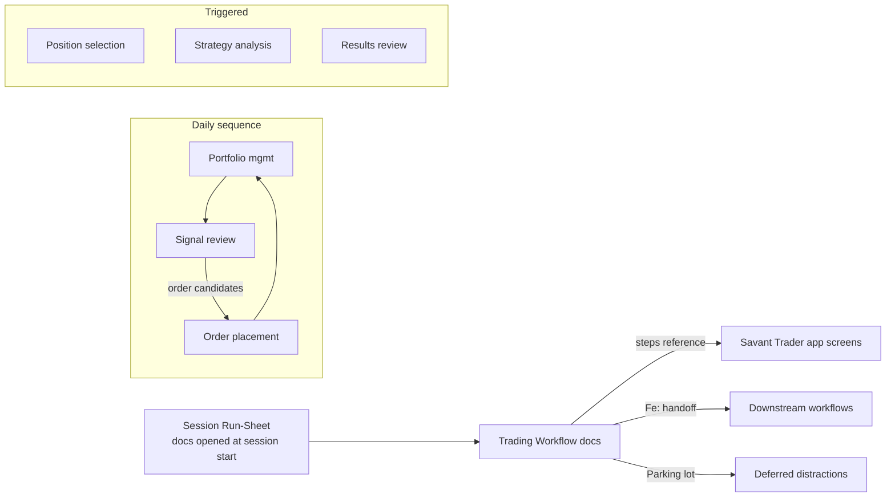

**Topic:** Navigation and Workflows  
**Topic Slug:** trading-workflows  
**Thread:** Workflow Foundation  
**Thread Slug:** foundation  
**Issue:** #627  
**Thread Parent:** #626  
**Topic Parent:** #625  
**Domain:** WORKFLOWS  
**Type:** PRD  
**Status:** Approved  
**Created:** 2026-09-28  
**Last Updated:** 2026-09-28  

# PRD: Workflow Foundation — Navigation and Workflows

## Problem Statement

Daily trading operations involve several distinct use cases — portfolio management, signal review, position selection, order placement, strategy analysis, results review — each of which walks through multiple app features. Without a defined procedure for each, the trader relies on memory and ad-hoc habit, which produces two failure modes: **incompleteness** (steps skipped) and **distraction** (wandering off task mid-workflow — e.g., drifting into charts and losing the thread of the task). The work needs to be thorough *and* efficient every day, not just on disciplined days.

## Solution

Establish **Trading Workflows**: documented, ordered procedures — one per use case — written as markdown checklist docs that live in the repo and are read in an editor tab beside the running app. This Thread (foundation) delivers the shared scaffolding:

1. **The Workflow Template** — the doc format every workflow follows (Purpose / When / Timebox / Inputs / Feeds / Steps / Exit criteria / Parking lot).
2. **Conventions** — file naming, the `Feeds:` handoff convention, the `(manual)` step tag for use cases whose UI doesn't exist yet, and the doc-as-script usage model.
3. **A Session Run-Sheet** — the single doc opened at session start; sequences the daily workflows and lists event-driven workflows with their triggers.
4. **One complete pilot workflow** — *Signal Review* — written fully per the template to prove the format against a real case.

No UI, no code, no persistence layer. Checklists are markdown `- [ ]` items — optional visual scaffolding during a session, and parseable by a future in-app checklist UI if real use proves one is needed (that decision is deliberately deferred).

## User Stories

1. As a trader, I want a written procedure for each trading use case so that I complete daily operations thoroughly without relying on memory.
   - **Verify:** the template doc exists and defines every required section; the pilot workflow follows it exactly.
2. As a trader, I want each step to name where I act — an app screen/route or a `(manual)` tag — so that I never wonder "where do I do this?"
   - **Verify:** every step in the pilot workflow either references an app destination or carries the `(manual)` tag.
3. As a trader, I want a timebox on each workflow (and rough per-step estimates) so that I notice when I'm rabbit-holing.
   - **Verify:** the template requires `**Timebox:**`; the pilot carries a concrete total and per-step estimates.
4. As a trader, I want a parking lot to capture stray thoughts mid-workflow so that distractions are deferred instead of acted on or lost.
   - **Verify:** the template includes a Parking lot section with guidance to record-not-act.
5. As a trader, I want one run-sheet to open at session start so that I know the day's workflow order without reconstructing it.
   - **Verify:** the Daily Session run-sheet lists daily workflows in order (starting with portfolio management) and a triggered section for event-driven workflows.
6. As a trader, I want workflows to declare what they hand off to so that outputs (e.g., order candidates from signal review) flow into the right next workflow.
   - **Verify:** the template requires `**Feeds:**`; the pilot declares its handoff to order placement.
7. As a trader, I want to follow a workflow doc open beside the app without maintaining session state so that using it adds zero bookkeeping overhead.
   - **Verify:** conventions state the doc-as-script model — checkboxes optional, no per-session copies or state.
8. As a maintainer, I want a fixed filename + location convention for workflow docs so that new workflows land consistently.
   - **Verify:** conventions doc defines `docs/topics/625-workflows/` and the `625-{stage-issue-#}-{task-#}-WORKFLOW-workflows-{workflow-slug}.md` pattern.
9. As a maintainer, I want the workflow inventory visible in one place so that build status per workflow is trackable.
   - **Verify:** the run-sheet includes an inventory table listing all six planned workflows with their status.
10. As a maintainer, I want each future workflow to get its own Thread so that workflows are refined independently.
    - **Verify:** conventions doc states the per-workflow Thread model and how to add one (`/proj add-thread 625`).

## Implementation Decisions

- **Docs-only deliverable.** Three artifacts in `docs/topics/625-workflows/`: the template+conventions doc, the Daily Session run-sheet, and the pilot Signal Review workflow. No application code, no Firestore schema, no functions.
- **Template skeleton** (decided in grilling): header fields `Purpose` / `When` / `Timebox` / `Inputs` / `Feeds`; `## Steps` as markdown checkboxes with per-step destination + minute estimates; `## Exit criteria`; `## Parking lot`.
- **`(manual)` tag** marks steps whose app surface doesn't exist yet (e.g., option-spread position-type selection) — the step describes the manual procedure instead of a screen.
- **`Feeds:` field** names downstream workflows; combined with the run-sheet it makes the workflow graph explicit (signal review → order placement).
- **Session model:** one Daily Session run-sheet. Additional session types (weekly review, research days) can be added under the same convention if they prove distinct — deferred.
- **Workflow inventory** (confirmed): portfolio management, signal review, position selection, order placement, strategy analysis, results review. Daily order starts with portfolio management; build order is decided per-Thread later — pilot chose signal review because it's easiest to model.
- **Filename convention** for workflow docs: `625-{stage-issue-#}-{task-#}-WORKFLOW-workflows-{workflow-slug}.md` in `docs/topics/625-workflows/`.

## Testing Decisions

No executable tests — this Thread produces documentation only. Verification is acceptance-driven:

- **Conformance check:** does the pilot workflow instantiate every template section correctly? (review checklist item)
- **Real-use UAT:** run a session following the pilot workflow + run-sheet; gaps, awkward granularity, or missing sections feed back into the template as revisions.
- **Standard gates:** the task still passes `/proj review` (doc review) and `/proj qa` before shipping, per the normal lifecycle.

## Out of Scope

- Any in-app checklist UI or session-state persistence (deferred until workflows stabilize in real use).
- The other five workflow docs — each is its own Thread under Topic #625.
- Additional session run-sheets (weekly review, research days).
- Changes to app features the workflows reference (e.g., building the missing option-spread selection UI — that's its own work).
- Auto-tracking timeboxes or timers.

## Further Notes

- The measurable bet: distraction drops because the next action is always written down, and stray thoughts go to the parking lot instead of being chased. If the docs get ignored in practice, the honest conclusion is that docs alone don't fix it — which is the evidence that justifies (or kills) the checklist UI.
- Timebox values in the pilot are starting estimates, to be tuned by actual use.

## System Context

