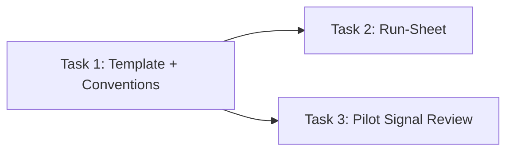

**Topic:** Trading Workflows  
**Topic Slug:** trading-workflows  
**Thread:** Workflow Foundation  
**Thread Slug:** foundation  
**Issue:** #636  
**Thread Parent:** #626  
**Topic Parent:** #625  
**Domain:** WORKFLOWS  
**Type:** Implementation Plan  
**Status:** Complete  
**Created:** 2026-09-28  
**Last Updated:** 2026-09-28  

# Implementation Plan: Workflow Foundation (SHARED)

Docs-only Thread. Three markdown artifacts in `docs/topics/625-workflows/`, produced by three sequential/parallel tasks under a single SHARED Blueprint. No code, no schema, no deploy steps.

## Artifacts

### 1. Workflow Template + Conventions doc — Task 1

`625-{stage-#}-CONVENTIONS-workflows-foundation.md` (name decided at task time within convention)

Contents:

- **Template skeleton** — the approved format:
  - Header fields: `**Purpose:**` / `**When:**` (trigger + cadence) / `**Timebox:**` (total budget) / `**Inputs:**` / `**Feeds:**` (downstream workflows)
  - `## Steps` — markdown `- [ ]` items; each step names an app screen/route or carries a `(manual)` tag; rough minute estimates
  - `## Exit criteria` — what "done" means, including handoff output
  - `## Parking lot` — capture distractions, defer action
- **Conventions:**
  - Docs live in `docs/topics/625-workflows/`; workflow docs named `625-{stage-issue-#}-{task-#}-WORKFLOW-workflows-{workflow-slug}.md`
  - `Feeds:` declares Workflow Handoffs; combined with the run-sheet it makes the workflow graph explicit
  - `(manual)` tag = the step's app surface doesn't exist yet; describes the manual procedure
  - Doc-as-script model: open in editor beside the app, checkboxes optional, no session state, no daily copies
  - Each future workflow gets its own Thread (`/proj add-thread 625`); timebox values start as estimates tuned by use

### 2. Daily Session run-sheet — Task 2 (blocked by Task 1)

`625-{stage-#}-RUNSHEET-workflows-daily-session.md` (name decided at task time)

Contents:

- Daily workflow sequence in live order: portfolio management → signal review → (event-driven slots)
- Triggered section: event-driven workflows + their triggers (position selection, order placement)
- Weekly/periodic section: strategy analysis, results review
- Inventory/status table: all six workflows × doc status
- Session-level timebox guidance
- Parking lot section (same convention as workflow docs)

### 3. Pilot workflow: Signal Review — Task 3 (blocked by Task 1)

`625-646-649-WORKFLOW-workflows-signal-review.md`

A complete, real workflow doc following the template exactly:

- **When:** daily, after the detection run completes
- **Steps:** the actual signal-review procedure — review flagged/new signals, swing-analysis pass on candidates, triage into symbol lists, flag order candidates — each with app destination (signal-review page, swing-analysis page, list actions) or `(manual)`
- **Feeds:** order placement (approved candidates become its input)
- Realistic starting timebox + per-step estimates

## Sequencing

T2 and T3 are independent — either order, or parallel.

## Conformance rule

Task 3's doc must instantiate **every** template section — the pilot is the proof case. Any gap discovered while writing it is a template defect: fix the template, not the pilot.
