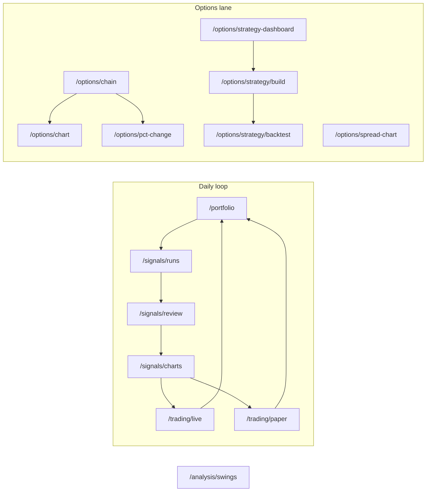

**Topic:** Navigation and Workflows  
**Topic Slug:** trading-workflows  
**Thread:** Journey Navigation  
**Thread Slug:** journey-navigation  
**Issue:** #661  
**Thread Parent:** #660  
**Topic Parent:** #625  
**Domain:** WORKFLOWS  
**Type:** PRD  
**Status:** Approved  
**Created:** 2026-09-29  
**Last Updated:** 2026-09-29  

# PRD: Journey Navigation — Navigation and Workflows

## Problem Statement

The app's navigation reflects its Relative-Strength-heatmap origins, not the product it has become. The daily trading loop — portfolio → run → signal review → chart review → order — crosses ~5 routes, **4 of which have no nav entry at all**; meanwhile ~11 of 19 sidenav items point at dormant legacy surfaces. A dozen live surfaces (signal-order, swing-analysis, paper-trading, strategy-builder, backtest, option/spread charts, …) are reachable only via in-page pills or memory. The in-page handoffs already work — what's missing is a **map that shows the path**: journey-organized nav, a route tree whose URLs name the journey, and a header that still brands the app "Relative Strength Heatmap" while carrying legacy affordances (refresh-time, symbols) nobody uses.

## Solution

Reorganize navigation and routes around the trader's task flow. **No new surfaces; existing pages unchanged.**

1. **Grouped sidenav** — flat labeled groups ordered by the daily journey: Portfolio → Signals → Trading → Options → Analysis → Tools → (auth tail). Removing ~13 legacy nav links; adding ~12 orphaned live routes. Sidenav stays an overlay drawer (`mat-drawer mode="over"`), unchanged behavior.
2. **New route tree** — domain-prefixed canonical paths (`/portfolio`, `/signals/*`, `/trading/*`, `/options/*`, `/analysis/*`, `/tools/*`). **No redirect aliases** — legacy surfaces are being deleted soon and there is no nav history to support; the literal `navigate(['/…'])` sweep is therefore mandatory (a stale literal falls through the `**` wildcard to `/`).
3. **Auth-aware nav** — login/logout gets its own flow; nav items gate on auth status.
4. **Header refactor** — rebrand to **Savant Trader** with updated styling; strip the legacy affordances (refresh-time, symbols button); add a unified global show/hide control so header visibility stops depending on which page remembered to add a button.

## Route Tree (canonical)

```text
/                           → redirect → /portfolio

/portfolio                  → Portfolio Dashboard          [landing]
/portfolio/allocation       → Portfolio Allocation

/signals                    → redirect → /signals/runs
/signals/runs               → Run Dashboard                [funnel root — pick a run]
/signals/review             → Signal Review
/signals/charts             → Chart Review

/trading/live               → Signal Order
/trading/paper              → Paper Trading

/options                    → redirect → /options/chain
/options/chain              → Option Chain
/options/pct-change         → Option Chain % Change
/options/chart              → Option Chart (contract viewer)
/options/spread-chart       → Spread Chart
/options/strategy-dashboard → Options Strategy Dashboard
/options/strategy/build     → Strategy Builder
/options/strategy/backtest  → Strategy Backtest

/analysis/swings            → Swing Analysis

/tools/account              → RH Account Inquiry
/tools/topic-viewer         → Topic Viewer (dev-lifecycle UI — landed as topic-viewer)
/dev/flex-chart             → Flex Chart Sandbox           [hidden]

/login  /signup             → auth pages
/dashboard-v3               → Dashboard V3                  [sidenav tail item]
```

Removed-from-nav routes stay registered and URL-reachable (not deleted): `dashboard`, `dashboard-v2`, `decision-board`, `positions-view`, `heatmap-view`, `heatmap-chart/:b/:s`, `rs-chart`, `rs-table`, `sync-chart`, `history`, `trade-journal`, `documentation`, `contact`. Every renamed path gets a `redirectTo` alias. `signal-history` and `signal-action-report` keep their current routes (nav inclusion is future scope).

## Sidenav Groups

| Group | Items |
|---|---|
| Portfolio | Portfolio Dashboard, Portfolio Allocation |
| Signals | Runs (Run Dashboard), Signal Review, Chart Review |
| Trading | Live (Signal Order), Paper (Paper Trading) |
| Options | Chain, % Change, Chart, Spread Chart, Strategy Dashboard, Build, Backtest |
| Analysis | Swing Analysis |
| Tools | Account Inquiry, Topic Viewer |
| (tail) | Dashboard V3 |
| (auth) | Log in / Sign up *or* Log out — by auth status |

The `NavItem` model supports grouped rendering (new `section` field or equivalent); groups are flat labeled headers, not collapsible.

## User Stories

1. As a trader, I want nav organized by my daily journey so that the map matches the path I actually walk.
   - **Verify:** sidenav renders labeled groups in the order above; every live route has exactly one nav slot.
2. As a trader, I want the daily pipeline surfaces (runs → signal review → chart review → order) in nav so that I don't depend on in-page pills or memory to reach them.
   - **Verify:** `/signals/runs`, `/signals/review`, `/signals/charts`, `/trading/live` are all nav-reachable in one click.
3. As a trader, I want legacy RS-heatmap items out of my nav so that dormant surfaces stop competing for attention.
   - **Verify:** none of the 13 removed items appear in header or sidenav; their routes still respond when visited directly.
4. As a trader, I want URLs that name the journey so that a route I type or share reads sensibly (`/options/chain`, `/trading/paper`).
   - **Verify:** canonical paths resolve; no stale literal paths remain in code (all in-page navigation resolves through `AppRoutes` or the canonical literal).
5. As a trader, I want auth items to reflect my sign-in state so that I don't see "log in" when signed in.
   - **Verify:** unauthenticated → login/signup visible, authed surfaces gated; authenticated → logout visible, login/signup hidden.
6. As a maintainer, I want a single source of truth for routes so that renames don't silently strand links.
   - **Verify:** nav links and in-page navigation resolve through `AppRoutes` or canonical literals; the ~8 literal `navigate(['/…'])` call sites are swept (no redirect aliases — stale literals would fall through to `/`).
7. As a trader, I want a slim consistent header — Savant Trader brand, menu, fullscreen toggle, auth — and a way to hide/show it on any page, so that chart pages get full height and I can always get the header back without hunting for a page-specific button.
   - **Verify:** header shows the new brand + only menu/toggle/auth; a toggle hides it from any page; when hidden, a top-edge reveal affordance (slim bar or floating control) restores it; pages that auto-enter fullscreen on init keep doing so (opt-in unchanged).

## Out of Scope

- New UI surfaces (Today page, dashboards) — surfaces are liked as-is.
- Option chart + spread-chart merge — different paradigms/stores; possible future refactor.
- `/options/strategy/config` shape library + `/options/position-builder` — future surfaces (needs more grilling; position-builder may overlap strategy-builder's use case).
- `/signals/history` + `/signals/report` nav placement — future scope.
- Balances-visible privacy concern on the landing page — noted for future work.
- Deleting legacy routes/components — removal means nav-links-only this pass.

## Technical Context

- `NAV_MENU_ITEMS` (`src/app/core/common/constants.ts`) is the single array feeding header + sidenav; header renders `external: true` items only, sidenav renders all.
- Navigation is mostly `AppRoutes`-enum-driven (~20 refs); ~8 literal `navigate(['/…'])` call sites exist in `signal-review.facade.ts`, `order.component.ts`, `triage-report.component.ts`, `signal-history.component.ts` — sweep is mandatory, no aliases.
- Nav data model becomes `NavSection[]` (`{ label, items: NavItem[] }`) — groups are structural data, not a render tag. Sidenav iterates sections; header no longer renders `NAV_MENU_ITEMS` at all (brand + menu + fullscreen toggle + auth only).
- Hidden-header reveal affordance: a floating chevron button pinned top-edge (visible only when the header is hidden) — not a hover strip.
- `savant-trader/` prefix routes (`option-chain`, `swing-analysis`, `flex-chart-sandbox`) flatten into their domain prefixes.
- `authGuard` already protects feature routes; auth-flow + nav gating builds on `AuthStore.isAuthenticated`.
- Header visibility already has a global mechanism: `UiStateService.fullscreen` gates `<rs-header>` in `core.component`, and ~12 pages opt in via `setFullscreen(true)` on init. The gap is *control*, not mechanism — per-page toggle buttons exist only on ~5 surfaces (signal-review-header, chart-toolbar, pct-change, triage-report, swing-analysis). This work lifts the toggle to a universal control and adds a reveal affordance for the hidden state. Per-page buttons may stay or defer to the global control (impl decision); existing auto-hide behavior must not regress.
- Legacy header affordances `rs-refresh-time` and the `symbols` dialog button are removed with the header refactor (both flagged legacy by the owner).



## Known Future Directions (not this Thread)

- `/options/strategy/config` — runtime-definable named spread shapes (jade-lizard, broken-wing-butterfly) parameterized in `build`; open question: save object configs at runtime vs. typed library.
- `/options/position-builder` — the planned position-selection surface (run-sheet's middle hop); may overlap strategy-builder — needs review when scoped.
- Nav badges/counts (e.g., raw signal count on Runs) — affordance deferred.
