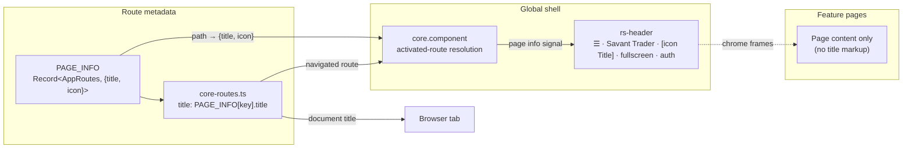

# PRD — App-wide Header Unification

**Topic:** Navigation and Workflows  
**Topic Slug:** `trading-workflows`  
**Thread:** App-wide Header Unification  
**Thread Slug:** `header-unification`  
**Issue:** #824  
**Thread Parent:** #823  
**Topic Parent:** #625  
**Domain:** WORKFLOWS  
**Type:** PRD  
**Status:** Approved  
**Created:** 2026-10-06  
**Last Updated:** 2026-10-07  

## Summary

The app has no standard way to name the page you're on. ~15 feature pages
each roll their own header markup — three dedicated header components
(`signal-review-header`, `review-header`, `gallery-header`) plus inline
header rows across dashboard, options, paper-trading, run-dashboard,
signal-order, and others. Each reinvents layout, height, and typography.

This thread gives the global `rs-header` a **page identity zone**: every
route carries a canonical `title` + `icon`, declared once in a single
registry, and the slim global bar renders icon + title for whatever page
is active. Pages stop writing header markup just to name themselves.

## Goals

- Every routed page is identifiable at a glance — icon + title in the
  persistent global header.
- Adding a new route *forces* a title/icon declaration at compile time —
  the convention is structural, not policed.
- Page title markup that only restates the page name is deleted.
- Browser tab titles follow the same canonical titles for free.

## Non-goals (explicitly deferred)

- Rich per-page controls in global chrome (filter pills, run selectors,
  action buttons). If a need emerges later, the evaluated design is a
  CDK-portal context zone — a separate thread.
- Reworking control-bearing headers (`gallery-header`,
  `signal-review-header`, `review-header`). They keep their controls and
  whatever context text they show today.
- Redesigning `rs-header`'s existing brand/sidenav/fullscreen/auth slots.

## User stories

### US-1 — Page title registry

**As** a developer adding a route, **I want** a single registry mapping
every `AppRoutes` value to `{ title, icon }`, **so that** titles and icons
are declared once, in one file, and a missing entry is a compile error.

**Acceptance criteria:**

- A `PAGE_INFO` record keyed on the `AppRoutes` enum declares
  `{ title: string; icon: string }` for every app route.
- `Record<AppRoutes, ...>` exhaustiveness: adding an `AppRoutes` member
  without a `PAGE_INFO` entry fails typecheck — verified by a spec that
  iterates `Object.values(AppRoutes)` and asserts each key resolves.
- The registry lives with the other nav/route constants
  (`core/common/constants.ts` or a sibling module) — same home as
  `NAV_SECTIONS`.
- Wildcard/redirect routes (`''`, `'**'`) are not `AppRoutes` members and
  need no entry.
- Icons are Material Symbols names — the set `mat-icon` already renders.

### US-2 — Route table consumes the registry

**As** a developer, **I want** each route in `core-routes.ts` to set
`title` from `PAGE_INFO` (no inline title strings), **so that** the route
table stays dumb and the registry stays canonical.

**Acceptance criteria:**

- Every routed path in `core-routes.ts` (guarded, public, dev) declares
  `title: PAGE_INFO[AppRoutes.X].title`.
- A spec asserts every leaf route's `title` equals its registry title —
  no route can drift to a hard-coded string.
- Document `<title>` updates on navigation via `Route.title` → default
  `TitleStrategy` (no custom strategy needed).

### US-3 — Global header renders page identity

**As** a user, **I want** the global header to show the current page's
icon + title, **so that** I always know where I am regardless of what the
page itself renders.

**Acceptance criteria:**

- `rs-header` renders `[icon] [title]` immediately after the brand, in the
  existing left cluster: `☰ | Savant Trader | icon Title`.
- The displayed title/icon track the deepest activated route on every
  navigation, including auth-gated redirects (landing on a redirected
  destination shows *that* page's title) and signed-out routes (login /
  signup get registry entries too).
- A route with no `PAGE_INFO`-keyed path shows no title segment — blank,
  not a guessed label.
- On narrow viewports the brand wordmark collapses (icon/logo stays);
  page icon + title remain visible.
- Fullscreen mode: the title lives in the existing bar, so it hides with
  the bar and reappears via the reveal chevron — no special-casing.

### US-4 — Title-only markup sweep

**As** a maintainer, **I want** the page-name text that exists only to
identify the page deleted, **so that** there's exactly one place a page's
name comes from.

**Acceptance criteria:**

- Every page's top-of-content markup is audited; text that merely restates
  the page title (and carries no controls or context) is removed.
- Pages whose headers carry controls/context (filters, run dates, counts)
  keep those headers — only pure title text, if any, is considered for
  removal, and only where removal doesn't break layout.
- Each touched page still renders correctly at desktop and narrow widths.

### US-5 — Per-page header inventory (thread exit criterion)

**As** the product owner, **I want** a final pass over every routed page,
**so that** before the thread closes we know whether any remaining
per-page header content belongs in the global bar.

**Acceptance criteria:**

- The QA/UAT pass walks every route and records what each surviving
  header row still contains (title residue / controls / context).
- Findings are dispositioned: leave in place, or file as a follow-up
  (e.g., portal-based context zone under a new thread).
- No finding blocks ship — this is an inventory, not a refactor gate.

## Technical context (user-affecting)

- **Tab titles change.** `Route.title` drives the browser tab title; tabs
  will read e.g. "Signal Review" instead of the static app name — a
  benefit, not a regression.
- **Fullscreen unchanged.** Fullscreen pages keep their existing
  hide/reveal header behavior; the page title simply rides along.
- **Narrow viewports trade brand for title.** Below the breakpoint the
  wordmark yields to the page title — brand stays recoverable via the
  sidenav.

## Decisions recorded during planning

1. **Registry over route-data fields** — `PAGE_INFO` keyed by `AppRoutes`
   gives compile-time exhaustiveness; `data.title`/`data.icon` strings in
   the route table were rejected as convention-policed duplication.
2. **`Route.title` set from the registry** — free document titles via
   `TitleStrategy`; the header resolves the same registry entry from the
   activated route's path (path *is* the `AppRoutes` value).
3. **Placement** — left-clustered after brand; brand wordmark collapses
   first on narrow screens.
4. **Narrow sweep + inventory exit** — Tier-1 (title-only) deletion now;
   Tier-2 (control headers) untouched; the UAT inventory decides whether
   anything else earns global-chrome residency.

## System context

