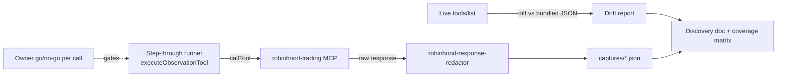

**Topic:** Robinhood MCP  
**Topic Slug:** robinhood-mcp  
**Thread:** Full RH MCP Tool Discovery  
**Thread Slug:** full-tool-discovery  
**Issue:** #659  
**Thread Parent:** #658  
**Topic Parent:** #657  
**Domain:** RH-MCP  
**Type:** PRD  
**Status:** Approved  
**Created:** 2026-09-28  
**Last Updated:** 2026-09-28  

# PRD — Full RH MCP Tool Discovery Inventory

## Problem

Every feature that consumes Robinhood's `robinhood-trading` MCP server (49 tools) needs to know each tool's request params and response shape. Today we have:

- `functions/.rh-mcp-tool-catalog.json` — all 49 tools' **input schemas** only, generated 2026-07-17 (may have drifted).
- `docs/implementations/RH-AGENT-ROBINHOOD-MCP-DISCOVERY-USAGE-2607-01.md` — distilled input tables + usage rules, but states "response-shape discovery in progress."
- Observed response shapes for only 3 tools (`get_option_chains`, `get_option_instruments`, `get_option_quotes`, per #117) plus ~8 typed shapes in the FE client.

Unknowns that currently block design decisions: response shapes for ~46 tools, error-envelope conventions, multi-leg option order support ("Exactly one leg" is prose-only — the schema has no `maxItems`), trailing-stop support (absent from the schema — cancel/replace is the workaround), stop-order direction semantics, and write-tool constraints (`create_watchlist`/`create_scan` have no delete counterpart).

## Goal

A single canonical discovery doc under `docs/topics/657-rh-mcp/` containing, for **every one of the 49 tools**: a distilled param table, observed response shape(s) from live probes, and per-tool notes (errors, pagination, limits, undocumented behavior). A coverage matrix makes completeness self-checking. Redacted raw captures live alongside as evidence.

## User stories

### US1 — Catalog drift check

As a maintainer, I want the live `tools/list` output diffed against `.rh-mcp-tool-catalog.json` so the doc reflects today's surface, not July's.

**AC:**
- Doc states the live tool count and generated-at date.
- Every added/removed/renamed tool and every inputSchema diff is recorded in the doc.

### US2 — Universal envelope documented

As a developer, I want the common response wrapper (`result.success`, error categories, `next_cursor` pagination, decimal-string numerics) documented once so per-tool sections stay focused on payload shape.

**AC:**
- Envelope section covers success wrapper, error category enum, cursor convention, decimal-string rule.
- Any tool deviating from the envelope is called out in its per-tool notes.

### US3 — Read-only sweep: every param permutation

As a developer, I want every read-only tool exercised with each optional param and each enum value so the doc records both the args and the observed response for every meaningful permutation.

**AC:**
- All ~36 read-only tools + both `review_*` simulation tools probed live.
- Every optional param appears in ≥1 captured request; every enum value exercised (spans, intervals, bounds, asset types, order states, indicators, position/order filters).
- Cursor pagination exercised end-to-end on at least one paginated tool (follow `next_cursor` ≥1 page).
- Documented exclusions allowed only where a permutation provably changes filtering, not shape (e.g. interval values that don't alter field structure) — each exclusion carries a rationale note in the doc.
- Per-call documented limits honored (e.g. ≤20 symbols per `get_equity_quotes` call).

### US4 — Equity order matrix (OOMA, 1 share, sequential)

As a developer, I want every equity order type + param combination probed with real 1-share OOMA orders so the doc captures real request/response pairs including fills, rests, cancels, and rejections.

Probe list (each `place_*` carries a unique `ref_id`; `review_equity_order` precedes each new type; strictly one open order at a time — capture, then cancel):

Buys: market gfd (fills); limit @ ask (fills); limit @ bid (rests → cancel); stop_market stop **above** market (rests → cancel); stop_market stop **below** market (fires or rejects — capture which); stop_limit (rests → cancel); `dollar_amount` $5 market (fractional fill); limit `gtc` (rests → cancel).

Exits (shares held): sell limit @ +2% target (rests → cancel); sell stop_market @ −2% stop-loss (rests → cancel); sell stop_limit (rests → cancel); cancel/replace demo — stop @ −2% → cancel → re-place @ −1.5% → cancel (manual trailing pattern); sell stop_market **above** market (fires or rejects); sell limit with `tax_lots` (real `open_lot_id` from `get_equity_tax_lots`) → cancel; oversell (qty > held) → rejection; final sell-all market → flat.

Short probe: sell 1 share of a zero-held symbol → capture the rejection (RH cash accounts can't short).

**AC:**
- Every matrix row has a captured request + response (or verbatim rejection) in the doc.
- Stop-direction semantics answered verbatim (which direction rests vs fires vs rejects).
- `ref_id` acceptance recorded; `tax_lots` path exercised.
- Account ends flat; every resting order was cancelled.

### US5 — Option probes (NFLX, 1 contract, ATM)

As a developer, I want single-leg and multi-leg option orders probed so the doc settles whether spreads are supported and what sell-to-open constraints apply.

Probe list: resolve ATM weekly call + put via `get_option_chains` → `get_option_instruments`; `review_option_order` buy-to-open with `chain_symbol` + `underlying_type` (captures fee/collateral fields); place buy-to-open limit @ ask (fills); sell-to-close limit (rests) → `cancel_option_order`; sell-to-close market (flat); buy-to-open `stop_market` and `stop_limit` (rest → cancel each); `review` + `place` 2-leg vertical **debit** call spread (resting limit); `place` 2-leg vertical **credit** call spread; sell-to-open **naked call** (expect rejection — capture verbatim); sell-to-open **put** (cash-secured) → capture accept or reject.

**AC:**
- Multi-leg support answered definitively — either both spread probes' responses captured, or the verbatim rejection error documented.
- Sell-to-open constraints recorded for both naked call and cash-secured put.
- Fee/collateral fields from the `chain_symbol`/`underlying_type` review variant captured.

### US6 — Error envelope captures

As a developer, I want deliberate invalid calls captured so the doc shows real error shapes, not guesses.

**AC:** ≥3 distinct errors captured with their categories — e.g. invalid symbol, missing required field, `cancel_*` on a bogus `order_id`.

### US7 — Discovery doc assembled

As a developer, I want one doc with a coverage matrix so completeness is checkable at a glance.

**AC:**
- One doc under `docs/topics/657-rh-mcp/`, one section per domain group (the 6 groups in `robinhood-tools.ts`).
- Coverage matrix up top: 49 rows × (params documented / probed / response captured / notes).
- Per-tool block: param table (from **live** schema), response field tree w/ nullability, ≥1 redacted JSON sample per probed variant, notes.
- Redacted raw captures committed as JSON files in the topic dir and linked.
- Safety classification per tool (read-only / simulation / account write / financial mutation).
- Gaps documented verbatim: no `trailing_stop` order type (cancel/replace workaround), no `delete_watchlist`/`delete_scan`, multi-leg verdict, sell-to-open level requirements.

### US8 — Execution safety gates

As the account owner, I want zero financial-mutation calls fired without my explicit go so I can watch the RH app and veto each step.

**AC:**
- Probe session is step-through: each mutation call waits for an explicit per-call go.
- Regular market hours only for market-order probes.
- Abort procedure documented (cancel all open orders → flatten positions).
- No account numbers, tokens, or raw PII persisted — all captures pass through `robinhood-response-redactor`.

## Out of scope

- `create_watchlist`, `create_scan`, `follow_watchlist`, `unfollow_watchlist` probing — deferred to a follow-up task (no delete tools exist; created entities would be permanent).
- Production parsers, typed client wrappers, or code changes beyond the probe runner and doc.
- Credential/auth work — the local credential bundle already exists.
- Automated/scheduled re-discovery; multi-account coverage.

## Technical context

- **Runner:** local step-through via `executeObservationTool` (the `run-tool-observation.ts` pattern) — one call per gated step; redaction built in. No cloud deploy needed (the `rhOptionQuoteDiscovery` function already proved cloud credential portability).
- **Exposure:** ~$70 transient in OOMA shares; NFLX ATM option fills (~$10–20K per contract transient) — accepted by owner.
- **Constraint:** RH allows one open order per position — all resting probes run strictly sequentially.
- **Hours:** market-order probes require `regular_hours`; run during market session.
- **Env:** requires `NODE_OPTIONS` IPv4 workaround + local RH credential bundle.

## Testing decisions

This is a discovery/doc Thread — the "tests" are completeness checks, not unit tests:

- A verify script (`scripts/verify/rh-mcp-tool-inventory-*.ts` pattern) that cross-checks the doc against the live catalog: every tool name appears, every tool has a params block and ≥1 response block, coverage matrix rows sum to the catalog count.
- ACs above are the acceptance gate per user story.
