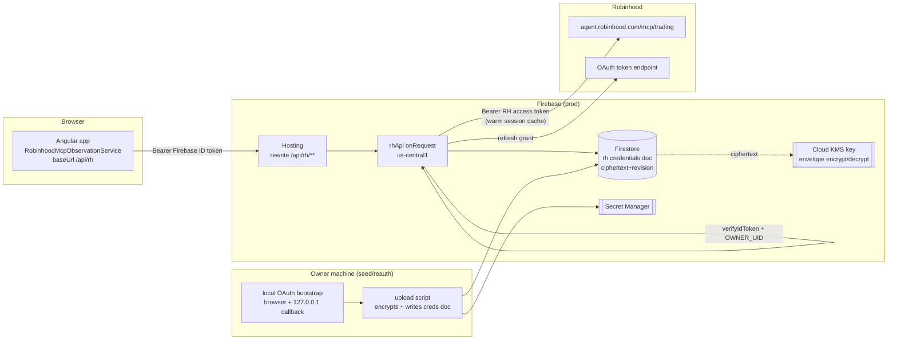

**Topic:** Robinhood MCP  
**Topic Slug:** robinhood-mcp  
**Thread:** Production RH API  
**Thread Slug:** production-rh-api  
**Issue:** #796  
**Thread Parent:** #795  
**Topic Parent:** #657  
**Domain:** RH-MCP  
**Type:** PRD  
**Status:** Approved  
**Created:** 2026-10-05  
**Last Updated:** 2026-10-05  

# PRD — Production RH API

## Problem

Every Robinhood-backed feature in the app depends on `/api/rh/**`, which exists only on the local dev machine: `proxy.conf.json` forwards it to the observation API on `127.0.0.1:3456` (spawned by `npm start`), and that API hard-refuses non-local environments. In production there is no route — Firebase Hosting's frameworks backend answers `404 Cannot POST /api/rh/tools/get_accounts`. Because the portfolio dashboard is the default landing route, every production login immediately fires a dead request, and the observation dashboard, order ticket, equity pricing, and order execution paths are all dead in prod.

## Goal

Serve the existing `/api/rh` tool surface from a deployed Cloud Function so all Robinhood features work on savanttrader.com for the owner account — with durable, rotatable credential storage, owner-only authorization, and per-page latency comparable to local.

## Non-goals

- Multi-user RH access — one owner, one brokerage credential set.
- Hosted/interactive OAuth in the cloud — Robinhood's consent ceremony stays local; the cloud only consumes a seeded credential bundle.
- New tool surface — the existing allowlist (`ALL_ENABLED_TOOLS`) is unchanged.
- Replacing the local observation API — dev keeps its localhost path unchanged.

## System context

## User stories and acceptance criteria

### US-1 — Portfolio dashboard live in prod

As the owner, opening the portfolio dashboard on savanttrader.com shows my real accounts, balances, positions, and orders.

- AC: `POST /api/rh/tools/get_accounts` in prod returns the same tool envelope shape as local (no 404).
- AC: account tabs, portfolio snapshot, equity + option positions, and orders populate from live data.
- AC: page-load fan-out uses one batch request per phase, not one HTTP request per tool call.

### US-2 — Full tool surface in prod

As the owner, the observation dashboard in prod lists all enabled tools and executes them.

- AC: `GET /api/rh/tools` returns the grouped tool catalog identical to local.
- AC: `POST /api/rh/tools/{name}` executes read, simulation, and mutation tools per the existing allowlist — including `place_equity_order`/`cancel_*` for the order ticket flow.

### US-3 — Owner-only authorization

As the owner, only my signed-in session can reach the RH API.

- AC: request without a token → 401.
- AC: request with a valid Firebase token for any other UID → 403.
- AC: no RH endpoint is reachable anonymously or cross-user.

### US-4 — Credentials survive token rotation

The RH refresh token rotates; unattended cloud operation must survive it.

- AC: when the refresh policy fires, the rotated bundle is persisted atomically (compare-and-swap on `revision`) — no lost rotation strands the credential.
- AC: no plaintext token, account number, or credential material appears in Firestore documents, environment variables at rest in plaintext-visible stores, or function logs (ciphertext only; logs carry tool name + category + outcome).
- AC: two concurrent function instances refreshing simultaneously cannot overwrite each other's rotated token.

### US-5 — Reauthorization is a guided, local-only ceremony

- AC: when the cloud credential is revoked/expired past refresh, tool calls return a structured `REAUTHORIZATION_REQUIRED`-style error the UI can render.
- AC: `POST /api/rh/auth/reauth` in prod returns that state (it never attempts interactive OAuth server-side).
- AC: a documented local procedure (OAuth bootstrap → export bundle → upload script) restores the cloud credential without redeploying.

### US-6 — Latency is not worse than a single MCP connect per page

- AC: within a warm function instance, consecutive tool calls reuse the connected MCP session — no per-call `connect()` handshake.
- AC: a dropped/expired MCP session reconnects once and retries transparently.
- AC: parallel requests during page load share one instance's session (function concurrency > 1).

## Technical context (user-affecting constraints)

- First call on a cold instance still pays one MCP connect + credential decrypt (~seconds); `minInstances: 1` keeps a warm instance. Subsequent calls are RTT + Robinhood's own tool latency.
- RH MCP session TTL/idle behavior upstream is unmeasured — the reconnect-once wrapper absorbs expiry; live observation needed.
- Reauth requires access to the owner's machine (browser ceremony + localhost callback); it cannot be completed from the cloud or a phone.
- Each call is proxied through Firebase Hosting → Cloud Function — one extra hop vs. direct function URL.
- Function config targets: us-central1, `timeoutSeconds ≥ 120` (MCP calls budget 45 s), concurrency > 1, `minInstances: 1`.

## Security notes

- Authorization: Firebase ID token verification + `uid == OWNER_UID`. No additional per-mutation gate — the allowlist already curates the surface; this decision is recorded for the blueprint.
- Credential store: Cloud KMS envelope encryption → ciphertext + revision in a server-only Firestore doc (client access denied by rules). No plaintext credentials in Firestore, matching the RH-AGENT-DIRECT-MCP-AUTH-PROOF invariant.
- Canonical session path preserved: cloud differs from local only in credential repository and interaction policy — same `executeObservationTool` / session code.
- Audit: each tool execution logs name, category, and outcome — never request args or response payloads.
