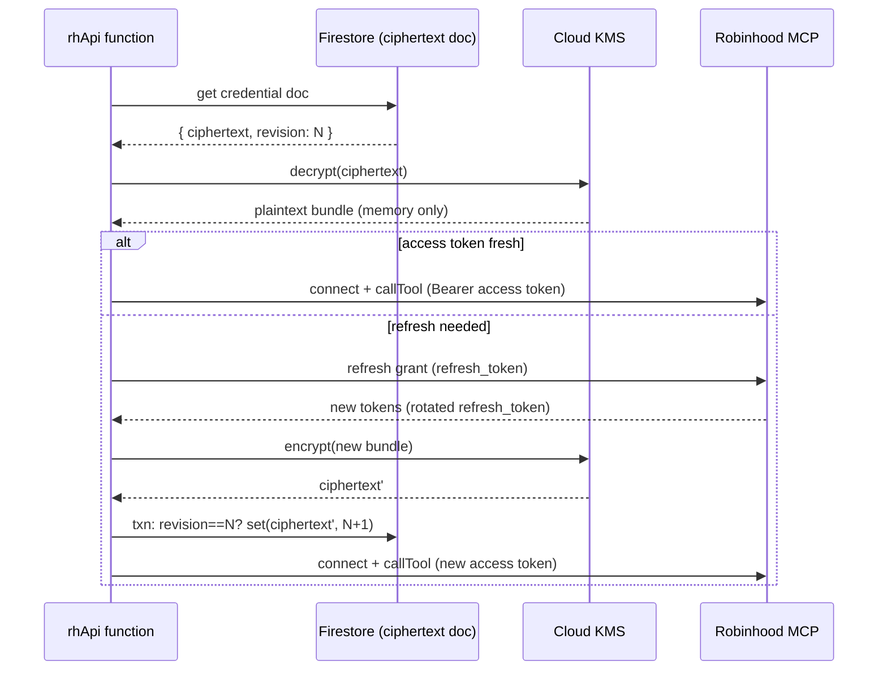

**Topic:** Robinhood MCP  
**Topic Slug:** robinhood-mcp  
**Thread:** Production RH API  
**Thread Slug:** production-rh-api  
**Issue:** #798  
**Thread Parent:** #795  
**Topic Parent:** #657  
**Domain:** RH-MCP  
**Type:** DESIGN  
**Status:** Approved  
**Created:** 2026-10-05  
**Last Updated:** 2026-10-05  

# Cloud Credentials & KMS — Primer

Background knowledge doc for Thread #795. Explains what the production
credential store is, why it needs each property, and what every moving part
(Google Secret Manager, Cloud KMS, Firestore CAS, refresh-token rotation,
envelope encryption) actually is. Read this before reviewing the IMPL doc.

## The problem in one paragraph

Robinhood's OAuth gives us an **access token** (short-lived, ~hours–days) and a
**refresh token** (long-lived, used to mint new access tokens). Cloud Functions
must hold these somewhere durable and *writable*: every successful refresh can
**rotate** the refresh token — the old one dies the moment the new one is
issued. If the storage is read-only (a deployed env secret), the first rotation
in the cloud leaves the stored secret holding a dead token, and the next cold
start fails with `invalid_grant` → manual re-auth forever.

So the store must satisfy three properties:

1. **Writable at runtime** — persist rotated tokens atomically.
2. **Compare-and-swap (CAS)** — two concurrent function instances must not
   overwrite each other's rotation (last-writer-wins loses a rotated refresh
   token = credential death).
3. **Never plaintext at rest in browsable stores** — Firestore console data is
   ciphertext, not tokens (invariant from RH-AGENT-DIRECT-MCP-AUTH-PROOF).

## The moving parts

### Google Secret Manager (SM)

A store for *secrets* (API keys, tokens). Properties:

- Values are **versioned**; `accessSecretVersion('latest')` reads, `addSecretVersion` appends.
- Access is IAM-gated (`roles/secretmanager.secretAccessor`).
- **No compare-and-swap**: `addSecretVersion` always appends a new version. Two
  writers racing produce two versions; "latest" is whoever wrote last. You cannot
  say "only write if the current revision is still 5."
- Secrets bound to a function via `{ secrets: [...] }` arrive as **env vars** —
  readable by the function (fine) but *exportable* by anything holding
  secretAccessor on the project, including the function's own runtime context.

Good for: static deployment-bound secrets (API keys, the bootstrap bundle).
Not sufficient alone for: rotating credentials needing CAS.

### Cloud KMS (Key Management Service)

A hosted key vault. The key **never leaves Google and is never exportable** —
there is no API that returns key material. Instead you call
`encrypt(plaintext)` / `decrypt(ciphertext)` and KMS does it inside the vault,
authorized by IAM (`roles/cloudkms.cryptoKeyEncrypterDecrypter` granted to the
function's service account on one specific key).

- Even with full access to the function's env vars and source, an attacker gets
  ciphertext only — decryption requires the IAM grant, which is not on the wire.
- Every decrypt call is recorded in Cloud Audit Logs.
- Hierarchy: project → **keyring** → **key** → key **versions** (rotation).

### Envelope encryption

The pattern KMS enables: KMS itself can only encrypt a few KB. For a credential
bundle (a few KB of JSON) KMS `encrypt()` suffices directly — no data-encryption-
key needed. ("Envelope encryption" strictly means KMS encrypts a data key that
encrypts the payload; for our size we let KMS encrypt the payload directly.)
Either way the invariant holds: **Firestore sees only ciphertext.**

### Firestore + compare-and-swap

Firestore transactions give atomic CAS for free:

```text
runTransaction:
  doc = get(rh-agent-credentials/bundle)
  if doc.revision != expectedRevision: abort (someone else rotated first)
  set({ ciphertext, revision: expectedRevision + 1 })
```

Both the read-check and the write happen in one atomic transaction — no race
window, no separate lease doc. This is exactly the `revision` CAS semantics
`PortableFileCredentialRepository` implements with its lockfile, so the existing
refresh coordination (`RepositoryOAuthProvider.saveTokens` → `store(expected)`) 
works unchanged.

## Why the chosen design composes them

| Requirement | Mechanism |
|---|---|
| Never plaintext in Firestore | KMS encrypt → store ciphertext only |
| Writable at runtime | Firestore `set` |
| CAS on rotation | Firestore transaction on `revision` |
| Key not exportable | KMS: no API returns key material; decrypt is IAM-gated |
| Audit trail | KMS decrypt calls logged; Firestore writes logged |
| Reuse existing code | same `RobinhoodCredentialRepository` interface |

Alternatives considered:

- **Bundle in Secret Manager + Firestore lease doc** — needs a two-system write
  (claim lease → addVersion) with a crash window between them; SM itself has no
  CAS. Same security boundary, strictly more failure modes.
- **AES key stored in SM (KEK) + ciphertext in Firestore** — same Firestore CAS
  benefit, but the key is exportable by anything with secretAccessor — weaker
  than KMS where the key is never materialized.
- **Static env secret** (`RH_CREDENTIAL_BUNDLE`, today's proof) — read-only;
  breaks on first refresh-token rotation.

## The runtime flow



## Seed and reauth (local-only ceremony)

Robinhood's OAuth consent requires a browser + localhost redirect — it cannot
run in a Cloud Function. So credential lifecycle ops stay on the owner's machine:

1. `npm run probe:rh-agent-mcp-auth` (existing) — interactive OAuth bootstrap,
   writes the DPAPI-encrypted local bundle.
2. `export-credential-bundle.ts` (existing) — decrypts to portable JSON.
3. `upload-rh-credential` script (new) — calls KMS encrypt (or reads it via the
   repo class) and writes the Firestore doc transactionally. Uses local admin
   SDK credentials (application default credentials) — no new HTTP endpoint.

Revocation: delete the Firestore doc. To revoke at the key layer, destroy the
key version (`cryptoKeyVersions.destroy`) — that instantly bricks all stored
ciphertext. Routine key *rotation* is safe: decrypt uses the version embedded
in the ciphertext, so old ciphertext keeps working.

## Failure modes worth knowing

| Failure | Behavior |
|---|---|
| Concurrent refresh from two instances | Second store() CAS-fails on revision, reloads doc, uses winner's tokens |
| Crash between refresh and store() | Old bundle still valid ONLY if RH didn't rotate; if it rotated, doc is dead → REAUTHORIZATION_REQUIRED → local re-seed |
| KMS decrypt permission revoked | All calls fail closed; doc is unreadable ciphertext |
| `invalid_grant` on refresh | Refresh token expired/revoked → REAUTHORIZATION_REQUIRED |
| MCP session dropped mid-life | Reconnect-once retry; new session over current tokens |

## Glossary

- **Access token** — short-lived bearer token on each MCP request.
- **Refresh token** — long-lived token exchanged for new access tokens; **rotates** on use.
- **Credential bundle** — `{ tokens, clientInformation, discoveryState, revision, ... }`.
- **CAS** — compare-and-swap: "write only if the current value is what I read."
- **Envelope encryption** — encrypting data with a key that is itself protected by a managed key vault.
- **KEK / DEK** — key-encrypting key / data-encryption key.
