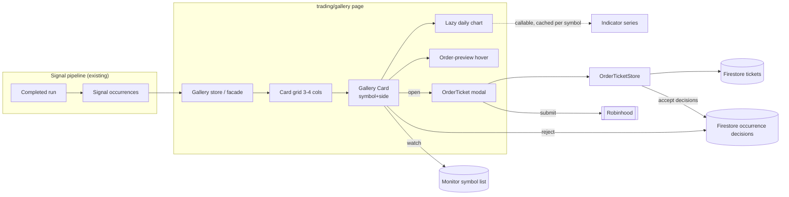

**Topic:** Gallery Order Ticket View  
**Topic Slug:** order-ticket-gallery-view  
**Thread:** Gallery View Page  
**Thread Slug:** gallery-view-page  
**Issue:** #745  
**Thread Parent:** #744  
**Topic Parent:** #743  
**Domain:** GALLERY-VIEW  
**Type:** PRD  
**Status:** Approved  
**Created:** 2026-10-03  
**Last Updated:** 2026-10-03  

## Problem Statement

Reviewing daily Savant Trader signals and acting on them currently spans two pages with a double review. On `signals/review` the trader triages signals and accepts them, which stages Order Tickets; on `trading/live` the trader reviews those staged tickets a second time before submitting. The signal itself is evaluated once and the order it produced is evaluated again — the same decision made twice on two surfaces. On top of that, charts are viewed one symbol at a time, so comparing today's signals against each other is slow.

The trader wants a single surface where every signal from the latest run is visible as a chart-bearing card, where the suggested order terms are reviewable in place, and where placing the order is one gesture — no separate accept step, no second review pass.

## Solution

A new routed page — the Order Ticket Gallery at `trading/gallery` — renders the latest completed run's signals as a responsive grid (3–4 columns) of cards, one card per symbol+side. Each card carries minimal signal details, a compact daily chart with the full default indicator set and a marker on the bar that fired, and a ticket button whose hover popup previews the derived order terms. Clicking the button opens the existing Order Ticket in a modal; submitting the order is the act — there is no accept list and no staging gate to review twice.

Card actions are deliberately small: **act** (open ticket, send order), **reject** (durable REJECT occurrence decisions, card removed), **watch** (symbol added to the Monitor list, card sinks to the end). Cards whose orders settle animate to the end of the list with distinct status styling, turning the tail of the gallery into a de-facto order queue.

The page becomes the primary signal review / order placement UI. `signals/review` and `trading/live` remain reachable during transition; entry is via a new "View Signal Gallery" button on the run dashboard, and the run dashboard will redirect to the gallery once it proves stable.

## User Stories

1. As a trader, I want a "View Signal Gallery" button on the run dashboard, so that I can reach the gallery from my daily starting point.
   - AC: the button navigates to `trading/gallery`; the route requires auth like other feature routes.

2. As a trader, I want one card per symbol+side for the latest completed run's signals, so that I see every actionable signal without paging through symbols one at a time.
   - AC: a symbol that fired both daily and weekly signals produces one card listing both contributing occurrences; the same symbol+direction never produces two cards.

3. As a trader, I want each card to show minimal signal details (symbol, name, direction, signal type + timeframe chips, bar date, signal close price), so that I can identify the setup at a glance.
   - AC: all contributing occurrences' signal types and timeframes are visible on the card.

4. As a trader, I want each card to embed a daily chart with the full default indicator set and a marker on the firing bar, so that I can eyeball the setup without opening a detail view.
   - AC: the chart reuses the quick-charts daily configuration (same indicators, ~30-bar window, signal-dot extras) at a compact card height.

5. As a trader, I want all signal and chart data prefetched when the gallery loads, with chart rendering deferred to scroll-into-view, so that the page feels instant and scrolling is jank-free.
   - AC: the signal set and indicator-series data load eagerly on page enter; chart components mount via `@defer (on viewport)` (render-all is the documented fallback if defer janks); off-screen cards show a placeholder.

6. As a trader, I want to filter cards by timeframe, side, and list membership, so that I can narrow the gallery exactly as I do on `signals/review` today.
   - AC: timeframe (all/daily/weekly), direction (all/long/short), and list (Triage / My lists / All) filters work; there is no group-dimension selector and no "show all symbols" toggle.

7. As a trader, I want to sort the gallery by sector→industry→symbol, market cap→symbol, or list, so that I can scan in the order that suits the session.
   - AC: switching the sort reorders unactioned cards; acted/watched cards remain sunk at the end regardless of sort.

8. As a trader, I want the order-ticket button to show a hover popup with the suggested order terms (side, whole-share quantity from position sizing, suggested stop price, order type, time-in-force), so that I can evaluate the trade without opening the ticket.
   - AC: hovering the button displays the derived terms computed the same way `trading/live` derives them; clicking still opens the ticket modal.

9. As a trader, I want clicking the button to open the existing Order Ticket in a modal dialog, so that I can adjust terms and submit without leaving the gallery.
   - AC: the modal hosts the existing ticket component including its confirm dialog and execution feedback; the gallery remains mounted behind it.

10. As a trader, I want orders placed from the gallery to be whole-share only, so that every entry is eligible for a protective stop.
    - AC: the ticket launched from a card permits whole-share quantities only; dollar-based/fractional order paths are not offered.

11. As a trader, I want the paper-trading path preserved in the ticket, so that I can paper-send a card's order exactly as on `trading/live`.
    - AC: paper-eligible tickets offer the paper flow unchanged.

12. As a trader, I want the card to show submitting styling while its order is in flight, so that I get immediate feedback after clicking submit.
    - AC: the card transitions to a distinct submitting appearance when the order is sent.

13. As a trader, I want a market order's fill confirmation to populate the stop-loss section in the ticket right away, so that I can place protection in the same session.
    - AC: on entry FILLED, the existing stop-loss form appears (whole-share entries), prefilled at the default stop percent off fill price.

14. As a trader, I want a card to animate to the end of the list once its order is settled, so that the gallery self-organizes into "still to review" vs. "done".
    - AC: cards sink when the stop is confirmed (market-order path), when a fractional-ineligible entry fills, or when the ticket reaches a terminal state; sunk cards show ordered styling.

15. As a trader, I want a resting limit order's card to show that state in place, so that I'm reminded the fill (and its stop) is still pending.
    - AC: a card whose ticket is SUBMITTED/QUEUED/RESTING but not filled stays in place with resting styling; the wait-for-fill → place-stop follow-up is owned by the positions workflow (future Thread), not this page.

16. As a trader, I want rejecting a card to write durable REJECT decisions for its contributing signal occurrences and remove the card, so that rejected signals stay out of the gallery and the decision history stays complete.
    - AC: each contributing occurrence gets a durable REJECT StOccurrenceDecision; the card disappears from the current run's gallery.

17. As a trader, I want watching a card to add its symbol to the Monitor list and sink the card to the end, so that the symbol is queryable tomorrow without me writing anything down.
    - AC: watch toggles Monitor membership (same mechanism as other surfaces); the card moves to the sunk section.

18. As a trader, I want the sunk section's cards to show their ticket status, so that the end of the list doubles as a view of today's order activity.
    - AC: acted cards display current ticket status; failed/cancelled tickets show distinct error styling rather than looking like completed orders.

19. As a trader, I want `signals/review` and `trading/live` to remain reachable during the transition, so that I have a proven fallback if the gallery has gaps.
    - AC: both routes continue to work unchanged; no redirects are installed in this Thread.

20. As a trader, I want the gallery's data model not to assume "latest run only", so that a future ≤5-day signal lookback lands without rework.
    - AC: the gallery reads a run-scoped signal set where the viewed run is a parameter, not a hardcoded "latest" lookup. (Lookback UI itself is a later increment.)

21. As a trader, I want a clear empty state when the latest run produced no signals or my filters match nothing, so that I know the page is working.
    - AC: distinct empty states for "no signals in run" and "all filtered out".

22. As a trader, I want to multi-select cards (click, ctrl/shift ranges, select-all-visible), so that I can triage several signals at once instead of actioning cards one at a time.
    - AC: cards show selected styling; a bulk action bar offers Reject and Watch applied to every selected unactioned card.

23. As a trader, I want bulk Reject to write durable REJECTs for every selected card and bulk Watch to add every selected symbol to Monitor, so that mass triage produces the same durable state as individual actions.
    - AC: bulk reject removes the selected cards; bulk watch sinks them; order placement remains per-card only.

## System Context

## Technical Context

- Signals come from the Savant Trader nightly run; the gallery's default scope is the latest **completed** run (SUCCESS or PARTIAL). Signal data and charts are as fresh as the last run — intraday bars are not part of this surface.
- Card charts are fed by the existing indicator-series callable, cached per symbol — one fetch per visible card, shared with other surfaces that read the same cache.
- Order submission, fills, and stops are broker-authoritative via Robinhood; local tickets record provenance only (per ADR-008). Fill timing is outside the page's control — resting limit orders can sit unfilled for days.
- Whole-share constraint: sizing derives whole units; fractional entry orders are deliberately not offered from this surface.
- The gallery does not replace the order-queue management on `trading/live` during the transition; terminal ticket states are visible on sunk cards, but queue-level operations remain on the old page.

## Implementation Decisions

- **New routed page** `trading/gallery` under the existing savant-trader feature, lazy-loaded and auth-guarded like sibling pages.
- **Card unit = symbol+side.** Cards aggregate contributing Signal Occurrences; the trade ticket is already deduped by symbol+side, so card state maps 1:1 to ticket state.
- **No accept/staging gate.** Acting on a card opens the Order Ticket directly; sending the order writes the ACCEPT occurrence decisions and the ticket↔decision linkage exactly as today's accept flow does.
- **Watch = Monitor.** The watch action toggles membership in the existing non-exclusive Monitor list — no new durable state is introduced.
- **Reject = durable REJECT** occurrence decisions per contributing signal; the card is removed for the viewed run.
- **Order preview = hover popup** on the ticket button, derived with the same position-sizing/stop utils and trading-config defaults the order page uses.
- **Chart = reuse** the quick-charts daily configuration and indicator-series cache, rendered compact (~240px); data prefetched eagerly, chart mount deferred to viewport.
- **Data loading = eager.** The gallery is the app's primary working surface, not a sideline page — the full signal set and indicator data load on page enter; only chart render is deferred (`@defer (on viewport)`, render-all fallback).
- **Multi-select.** Cards support click / ctrl+click / shift-range / select-all-visible selection; the bulk action bar offers Reject and Watch only — order placement stays per-card (extensible later).
- **Platform shell.** The gallery shell (grid, sort/filter rail, card host, sunk section, selection model) is card-type-agnostic; positions and order-management card types land in later Threads on the same page (see ADR-009). Card-type abstraction itself is deferred until the second card type exists.
- **Card ordering:** unactioned cards in the active sort order; acted/watched cards sink to the end ordered by action time.
- **Entry point:** "View Signal Gallery" button on the run dashboard. A future change will redirect the run dashboard to the gallery once stable — deferred, not part of this Thread.
- **Positions review** (per-position exit / move-stop / no-action → cash → open slots, including resting-limit fill follow-ups) is a second Thread on this same Topic, landing on the same page — explicitly out of scope here.

## Testing Decisions

- **Seams:** the gallery's state seam is a feature store/facade over the signal set, decisions, Monitor membership, and the ticket store — the same pattern as `signal-review.facade.ts`. Tests target that seam plus the card component's rendered behavior; the ticket modal is exercised through its existing component contract.
- **Prior art:** `signal-review` facade/store specs, `chart.store.spec.ts`, and `order-ticket.component.spec.ts` establish the NgRx-signals + component test style (jest-preset-angular, `jest.fn()`, stub Firebase providers, macrotask flush for async paths).
- **What good tests look like here:** card grouping correctness (D+W same symbol+side → one card), filter/sort behavior, action→durable-write mapping (reject writes REJECTs, watch writes Monitor, order send writes ACCEPTs + ticket), sink ordering, and lazy-mount behavior — external behavior only, not internal wiring.

## Out of Scope

- Positions review / cash → slots workflow (future Thread on Topic #743).
- Signal lookback UI (≤5 days) — the model is designed for it; the control surface is deferred.
- Retirement or redirect of `signals/review` and `trading/live`.
- Queue-level order management (bulk cancel, cross-symbol ticket table).
- A full order-queue panel on the gallery.
- Intraday/intrabar data on card charts.
- Fractional-share orders.

## Further Notes

- New durable concept introduced: none beyond reusing Monitor. `CONTEXT.md` was updated with the Gallery Card definition and Monitor's watch role.
- **Platform direction:** the gallery is intended to become the main working surface for the daily workflow — positions review, signal triage, order config/placement, and follow-up management all as card galleries. A detail page may follow; that's a later Thread. See ADR-009.
- The `signals/` route group's redirect target and nav entries may need updating when the gallery becomes primary — to be handled by the cleanup Thread, not this one.
