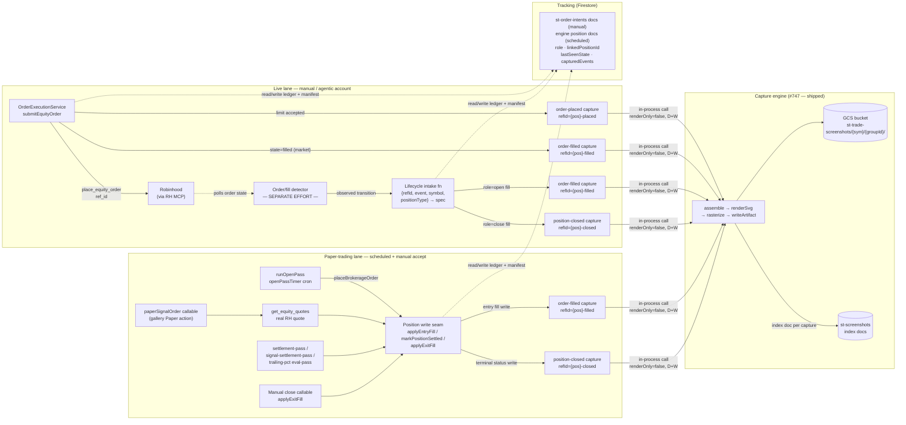

**Topic:** On-demand Screenshot Capture  
**Topic Slug:** screenshot-capture  
**Thread:** Screenshot Auto-capture with Orders  
**Thread Slug:** order-lifecycle-capture  
**Issue:** #827  
**Thread Parent:** #826  
**Topic Parent:** #746  
**Domain:** SCREENSHOT  
**Type:** PRD  
**Status:** Approved  
**Created:** 2026-10-06  
**Last Updated:** 2026-10-06  

# PRD — Order Lifecycle Auto-Capture

## Problem

Thread #747 built the complete capture engine — `captureChartSnapshot` renders a deterministic SVG (and optional PNG) from real Firestore bars + indicator series and persists it to GCS. But it can only be invoked manually via the callable or `/dev/screenshot`. The original motivation — *documenting the market conditions that existed when a position was opened and closed* — requires the engine to fire itself, unattended, at real trade lifecycle moments.

Nobody should have to remember to screenshot a chart. When an order is placed, when it fills, and when the position closes, a timestamped chart of the underlying should already be in the bucket.

## What this Thread is — and is not

The **capture-invocation seam** around the existing engine: when a lifecycle event fires, turn it into a stored screenshot — construct the spec, dedupe, call the capture core in-process, persist. It does not rebuild rendering, indicator pipelines, rasterization, or storage (shipped with #747, consumed as a stable seam).

**This Thread does NOT build detection.** The order-state poller / fill detector / trailing-stop watcher is a separate effort — it owns knowing *that* an event happened. This Thread owns what happens *when* it fires: the shared entry point detectors call, the event→spec mapping, the dedup ledger, and the hooks inside code paths that are already the moment of truth (the place call site, the position write seam).

## Event model

Three events, identical across paper-trading and live-trading surfaces:

| Event | Fires when | Chart documents |
|---|---|---|
| `order-placed` | A **limit** order is accepted by the broker/engine | The setup that justified the limit price |
| `order-filled` | An order reaches terminal state `filled` | Conditions at entry confirmation |
| `position-closed` | A position reaches a terminal status | Conditions at exit |

**Identity model — two granularities.** A signal "campaign" can fan out to a shares leg + multiple option legs/spreads, and each leg's fill is a distinct event moment. So the *capture identity* is per-position (`refId = {positionId}-{event}` — two legs filling under one group can't collide), while the *grouping* is per-campaign (`refIdRoot = {groupId}` — the GCS folder and index group all the campaign's shots together). Group root per lane:

| Lane | `refIdRoot` (group) | `refId` (per capture) |
|---|---|---|
| Signal campaign — paper | `cohortId` (the `PaperCohort` doc already anchors `tradeIds[]` for a signal's fan-out — the proto Position Group) | `{tradeId}-{event}` |
| Engine strategy | `positionId` (the engine Position doc already groups its legs) | `{positionId}-{event}` |
| Live — signal order | the signal's group identity: intent `signalId` today, `positionGroupId` once the Position Group resource lands | `{intentRefId}-{event}` |
| Live — ad-hoc manual | the opening intent's `refId` (degenerate group of one until Position Groups exist) | `{intentRefId}-{event}` |

This is forward-compatible with the Position Group concept (planned separately): when it lands, intent docs gain `positionGroupId` and the group root just starts pointing at it — no rework here.

Deliberately excluded:

- **Signal capture** — recording the moment a signal was *accepted* is too problematic to pin down and adds no event to the contract.
- **`order-placed` for market orders** — a market order's placed and filled moments are effectively identical; one shot suffices.
- **Partial-fill snapshots** — captures wait for terminal `filled`; a partially-filled order's executions accrue without firing.
- **Options-leg anatomy** — charts always render the **underlying** symbol. `positionType` becomes a path/label tag only; the chart itself is never basket-aware in v1.

## User stories

### US-1 — Engine entry capture

As a trader reviewing a paper-traded position days later, I want a stored chart of the underlying at the moment the engine opened it, so I can evaluate what the strategy saw.

**Acceptance criteria:**

- Given `runOpenPass` places an order for a strategy instance, when the place call returns an order id + fill price, then a capture runs with `event: order-filled`, `refId: {positionId}-filled`, `renderOnly: false`, and the underlying symbol.
- Given a user accepts a signal as paper from the gallery (the `paperSignalOrder` callable — the manual paper entry), when `applyEntryFill` writes the equity leg, then a capture runs with `event: order-filled`, `refId: {tradeId}-filled`. Same moment, different trigger than the scheduled pass.
- The capture must not block or fail the pass/callable — a capture failure logs and the position still opens.
- Re-running the open pass (or any retry) for the same position does not write a second capture — dedup on `(positionId, event)`.

### US-2 — Engine exit capture

As a trader reviewing a closed paper position, I want a stored chart of the underlying at the transition that ended it.

**Acceptance criteria:**

- Given a position transitions to a terminal status (`EXPIRED_WORTHLESS`, `CLOSED`, or an exit fill via `applyExitFill`) through `settlement-pass`, `signal-settlement-pass`, or a manual close callable, when the transition writes, then a capture runs with `event: position-closed`, `refId: {positionId}-closed`.
- The hook lives at the shared position-write seam (repository/adapter), not per-pass — a new close path gets capture for free.
- `ASSIGNED_HOLDING_SHARES` fires a capture of the *option position's* end (it is a terminal transition for the option leg even though shares remain). — open design call, see §Decisions.

### US-3 — Live order placed capture

As a trader who placed a limit order through ST, I want the underlying's chart stored at placement time.

**Acceptance criteria:**

- Given `submitEquityOrder` returns success with `type: 'limit'`, then a capture runs with `event: order-placed`, `refId: {positionId}-placed`, the order's symbol, `renderOnly: false`.
- Given the place response returns `state: 'filled'` (market order or instant fill), then `order-placed` is skipped and `order-filled` fires instead with `refId: {positionId}-filled`.
- The user's order flow never waits on the capture; a capture failure surfaces nowhere in the ticket UI beyond a log.

### US-4 — Detector intake contract (live fills/closes)

As the separate detection effort (order-state poller / fill watcher), I need a single documented entry point to call when a transition is observed — I hand it the event; it owns everything after.

**Acceptance criteria:**

- An exported lifecycle-capture function accepts `{ refId, event, symbol, positionType }` (or the equivalent spec) and runs the shipped capture core with `renderOnly: false`. Detectors call it; they don't construct captures themselves.
- A filled live order tagged `role: open` arrives as `order-filled`; `role: close` arrives as `position-closed` with `refId: {positionId}-closed` — the *caller* supplies role/position linkage via `st-order-intents`; this function maps them to event + refId, nothing more.
- Repeated detector calls for the same `(refId, event)` fire exactly one capture (transition ledger dedup) — the detector may re-observe a terminal state without consequence.
- Detection lag is a detector concern, not this thread's: captures render daily/weekly bars, so a fill noticed minutes late still right-anchors on the same daily bar.
- Orders not placed through ST (`placed_agent=user`) reaching the intake are logged and skipped — the contract assumes the detector only forwards agentic-account events.

### US-5 — Cross-surface dedup and bookkeeping

As a maintainer, I want one tracking record per ST order/position so captures are idempotent across retries, polls, and engine passes.

**Acceptance criteria:**

- The manual lane reuses **`st-order-intents`** — the existing ticket docs already carry `refId`/`side`/`symbol`/`quantity` and anchor both executors (live place + `paperSignalOrder`). This thread extends them with `role` (`open`|`close`), `linkedPositionId`, `lastSeenState`, and a `capturedEvents` ledger — no new collection for live-side tracking.
- The scheduled engine lane uses its own anchor: engine position/order docs already exist (`positionId` is the natural `refId` root); the same `capturedEvents` ledger convention applies there rather than minting intents for engine orders.
- Given an event already in the ledger, any subsequent trigger for `(refId, event)` is a no-op — dedup is a Firestore transaction on the doc, safe against concurrent triggers.
- A live closing order's intent doc links back to the opening intent/position via `linkedPositionId` — that's what lets a filled sell become `position-closed` instead of a bare `order-filled`.
- **The ledger is also the manifest:** each `capturedEvents` entry records `{event, capturedAt, paths: {svg, png}}` — the order doc can render its own screenshots without a bucket scan.
- Every persisted capture also writes an index doc to **`st-screenshots`** (`{groupId, positionId, event, symbol, capturedAt, paths}`) — the queryable surface the Screenshot Library (#799), "shots for this position," and the future per-group P&L report will read instead of enumerating the bucket.
- Artifact paths gain a group directory level — `st-trade-screenshots/{SYMBOL}/{groupId}/{ts}-{event}-{positionType}-{positionId}-{interval}.{ext}` — so per-campaign listing is a one-prefix `listAll`, not a filename scan. (Small change to `buildScreenshotStoragePath`; `renderOnly` playground captures are unaffected since they never write.)

## Technical context (user-affecting)

- **No push exists, and the pull isn't ours.** The RH MCP surface is pull-only — fill detection requires polling `get_equity_orders` (`placed_agent=agentic`, `state` filters, `executions[]` per-fill rows). That detector is built in a separate effort; this thread consumes its events. What this thread contributes to the boundary: the intake contract (US-4) and the `st-order-intents` fields (`role`, `linkedPositionId`, `lastSeenState`, `capturedEvents`) the detector reads/writes.
- **Chart freshness = last closed bar.** Captures render Firestore daily/weekly bars, which refresh on the data pipeline's cadence — an intraday fill captures the most recent *closed* daily bar. This is the intended semantics ("what the decision data showed"), not a defect.
- **Non-blocking everywhere.** Screenshot capture is documentation; it never blocks an order, a pass, or a UI flow. Worst case on failure is a missing artifact + a log line.
- **`positionType` contract extension.** The enum is stock-only today; this thread adds strategy tags (e.g. `vertical-debit-spread`, `calendar`, `stock`) as label values only — no per-leg rendering.
- **Engine degenerate case.** The engine's `placeBrokerageOrder` is currently a synchronous stub — placed ≡ filled in one tick. `order-placed` becomes meaningful in the engine only if/when it places real async limit orders.
- **Paper mimics live at the entry seam only.** `paperSignalOrder` already fetches a real RH quote (`get_equity_quotes`) and persists it via `applyEntryFill` (`quoteSource: RH_MCP`) — same ticket→quote→fill shape as live's ticket→review→place→fill. Divergences to be aware of: paper orders are always instant `MARKET` (no limit/pending states exist in paper), paper skips the `review_equity_order` preflight, and live has no position ledger at all — RH positions are the book of record there, while paper keeps its own `Position` docs.
- **Exits are asymmetric.** Paper positions can close unattended (trailing-`{pct}` governing variant via `exits/eval-pass`, settlement passes); live closes are only the user's manual sell orders today — no scheduled exit machinery exists for live positions.
- **Read path already exists.** `storage.rules` grants any authenticated client read on the bucket — `st-trade-screenshots/**` is fetchable via the Storage SDK (`getDownloadURL`/`listAll`) with no rules change. Writes remain backend-only.
- **No retention policy.** Artifacts accumulate indefinitely — acceptable at current volume; flag for later if bucket size becomes a cost.

## Decisions (open calls deferred from planning)

1. **Assignment capture** — does `ASSIGNED_HOLDING_SHARES` fire `position-closed` (the option position ended) or is it excluded because the trade continues as shares? PRD assumption: fire it — the option position ended and its chart is documentation-worthy.
2. **Detector contract shape** — whether the external detector calls an exported in-process function, a callable, or writes a watched doc that a Firestore trigger consumes. PRD assumption: exported in-process function, with `st-order-intents` docs carrying the bookkeeping both sides need.
3. **Tracking doc fields** — `st-order-intents` is confirmed as the manual-lane home (resolved); field names (`role`, `linkedPositionId`, `lastSeenState`, `capturedEvents`) and the engine-side carrier land at blueprint.
4. **`order-placed` call site** — fired by the placing caller (frontend service / open-pass) at submit time, not by the poller's first observation — keeps "placed" honest to the actual moment.

## System context

## Out of scope

- **Detection machinery** — the order-state poller, fill watcher, trailing-stop ratchet, and any scheduled functions that *observe* RH state. A separate effort owns knowing that an event happened; this thread owns firing the capture when told.
- Options-leg chart anatomy (strike markers, multi-leg overlays) — underlying only in v1.
- Signal-fired capture.
- Intraday/minute-interval screenshots.
- Manual-order fills in non-agentic accounts.
- The Screenshot Library display surface (Thread #799) — these artifacts land there later.
- Real broker limit orders inside the paper engine (engine keeps its simulated placer; the hook points stay correct regardless).
